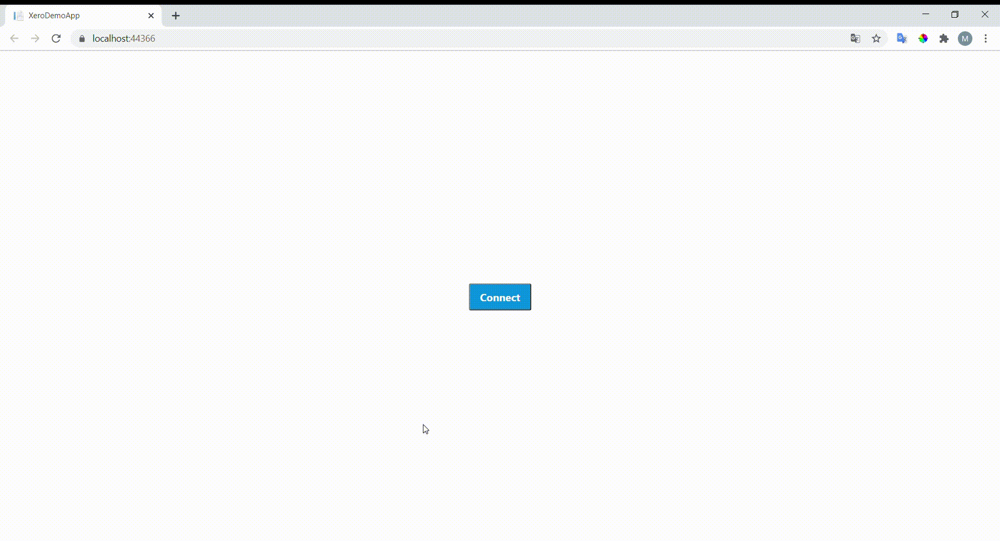
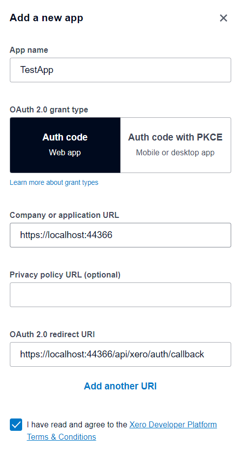
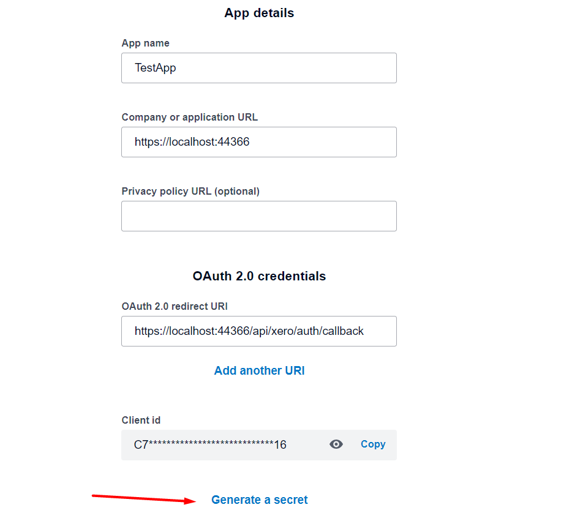

## Xero NetStandard OAuth 2.0 Starter App (Angular + NET 5)

This is a starter app build with Angular + NET 5 to demonstrate Xero OAuth 2.0 Client Authentication & OAuth 2.0 APIs.

Application was created using official guide https://developer.xero.com/documentation/oauth2/auth-flow

## How it works



## How to run

1. If you don't have Xero account create a new one https://www.xero.com/au/signup/
2. Navigate to https://developer.xero.com/
3. Create a new app 

4. Generate a secret

5. Clone the repository 
git clone `git@github.com:MarinaRybalko/XeroIntegrationDemo.git`
6. Replace XeroConfiguration properties in `appsettings.json`
```
 "XeroConfiguration": {
    "ClientId": "CLIENT_ID",
    "ClientSecret": "CLIENT_SECRET",
    "CallbackUri": "https://localhost:44366/api/xero/auth/callback",
    "Scope": "accounting.transactions accounting.attachments accounting.attachments.read offline_access",
    "State": "YOUR_STATE"
  }
```
 
### Install dotnet SDK 

[Download](https://dotnet.microsoft.com/download/dotnet/5.0) and install dotnet SDK on your machine.

Verify in command line by:
```
$ dotnet --version
5.0.100

```

###### Enjoy coding! :blush: :blush: :blush:
